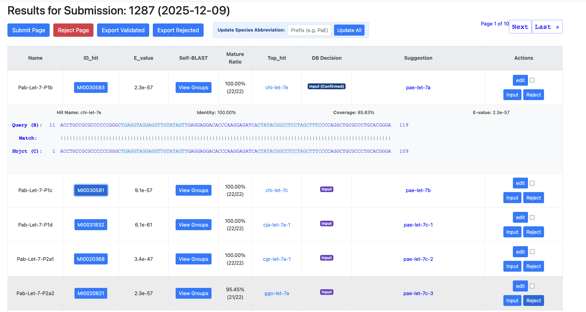
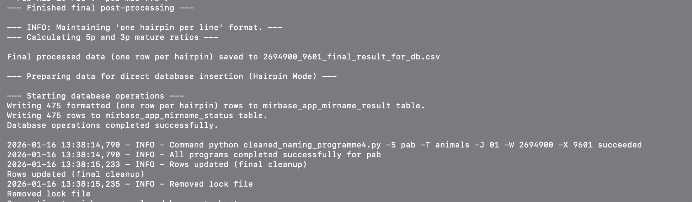

# miRName: The Orthology-Guided miRNA Annotation Pipeline

> **Note:**
> This repository serves as a **codebase demonstration** for the production pipeline developed at The University of Manchester.
> * **Bin/**: Contains the core algorithmic logic (Programmes 1-4).
> * **Screenshots**: Below demonstrate the deployed web interface used for high-throughput curation.
> * **Data**: Uses anonymized demo data for privacy compliance.

---

## System Dashboard Preview

The following screenshots showcase the interactive curation interface integrated with the pipeline. This dashboard allows researchers to visualize BLAST alignments and make "Accept/Reject" decisions efficiently.

### 1. Interactive Curation Dashboard
The UI visualizes the alignment between candidate sequences and known homologs, calculating identity matrices automatically.


*(Figure 1: The curation dashboard showing alignment visualization and decision buttons.)*

### 2. Pipeline Execution Log
The backend orchestration running on the High-Performance Computing (HPC) cluster.


*(Figure 2: Execution logs showing the wrapper managing concurrent naming tasks.)*

---

## Overview

**miRName** is a specialized bioinformatics pipeline designed for the **automated, orthology-based naming** of microRNAs (miRNAs) across diverse metazoan species.

Unlike traditional tools that assign names sequentially (e.g., *mir-1*, *mir-2*) without regard for evolutionary history, **miRName prioritizes evolutionary orthology**. It employs a multi-stage analysis pipeline to cluster sequences and utilizes a strict **"Top-Hit" evidence system**, ensuring new annotations are consistent with the miRBase registry.

**Key Goal:** Facilitate the transition from raw sequencing candidates to official database entries, resolving synonym conflicts and lineage fragmentation.

---

## Naming Logic

The core naming logic is enforced by the scripts located in the `Bin/` directory.

| Criteria | Action |
| :--- | :--- |
| **Identity > 95%**<br>(to known homolog) | **Strict Top-Hit Override.**<br>Forces the name to match the homolog (e.g., *mir-30b*), overriding sequential clustering. |
| **Identity < 95%**<br>(Novel/Ambiguous) | **Sequential Assignment.**<br>Suffixes (a, b, c...) assigned based on clustering order. |
| **Novel Family** | Assigned a temporary **Novel-ID** until unified by cross-species analysis. |

---

## Technical Specifications & Usage

```text
================================================================================
                        PIPELINE ARCHITECTURE & WORKFLOW
================================================================================

[ DIRECTORY STRUCTURE ]
  root/
   ├── naming_runner_mirbaseDB.py    # Master Wrapper (Orchestrator)
   ├── transfers_mirsubmit...py      # Data Ingestion Script
  Bin/
   ├── naming_programme1.py          # P1: Identification & Genome Mapping
   ├── naming_programme2...py        # P2: Homology Search (BLAST+)
   ├── naming_programme3.py          # P3: Evidence Integration
   ├── cleaned_naming_programme4.py  # P4: The Naming Engine (Clustering)
  TestData/
   ├── demo_input.fa                 # Anonymized input for demonstration

[ WORKFLOW COMPONENTS ]
  1. Data Ingestion
     Extracts metadata from user submissions (miRSubmit) and populates the
     SQL database processing queue.

  2. The Wrapper (Master Controller)
     - Monitors database for pending tasks.
     - Manages file locking for HPC concurrency.
     - Automatically calls sub-programmes (P1-P4) located in Bin/.

  3. Core Logic Modules (Bin/)
     - P1: Maps candidates to genome context.
     - P2: Performs local BLAST against miRBase hairpin database.
     - P3: Defines precise mature/star boundaries based on MIMAT.
     - P4: Applies V4.0 logic to cluster sequences and assign names.

================================================================================
                                     USAGE
================================================================================

# Prerequisites
  python >= 3.9, pandas, numpy, biopython, sqlalchemy, pymysql, ncbi-blast+

# 1. Ingestion (Migrate Data)
  $ python transfers_mirsubmit2mirname.py

# 2. Execution (Run Pipeline)
  # Triggers the wrapper to process all pending sequences in the queue.
  # Automatically invokes scripts in the Bin/ directory.
  $ python naming_runner_mirbaseDB.py

# 3. Visualization (Web Server)
  # Start the Django dashboard to view alignments (as shown in screenshots).
  $ python manage.py runserver 0.0.0.0:8000

================================================================================
                             OUTPUT FORMAT (miRBase)
================================================================================

The system generates a strictly formatted submission file for database insertion.

[ EXAMPLE OUTPUT ]
  INSERT   FAMILY    let-7
  INSERT   HAIRPIN   pae-let-7a     Pab-Let-7-P1    Predicted    UGAGGUAG...
  INSERT   MATURE    pae-let-7a-5p  experimental    sequenced
  INSERT   MATURE    pae-let-7a-3p  experimental    sequenced
  INSERT   HAIRPIN2MATURE    5    26    pae-let-7a    pae-let-7a-5p
